# Hotstar App Deployment Project - Complete Guide

## 📋 Project Overview

This project demonstrates the deployment of a **Hotstar Next.js application** on a Kubernetes cluster using modern DevOps tools and practices, following a **DevSecOps approach**. The application handles dynamic scaling based on traffic demand, scaling up during peak events (like major sports) and scaling down during low traffic periods.

### 🏗️ Architecture Overview

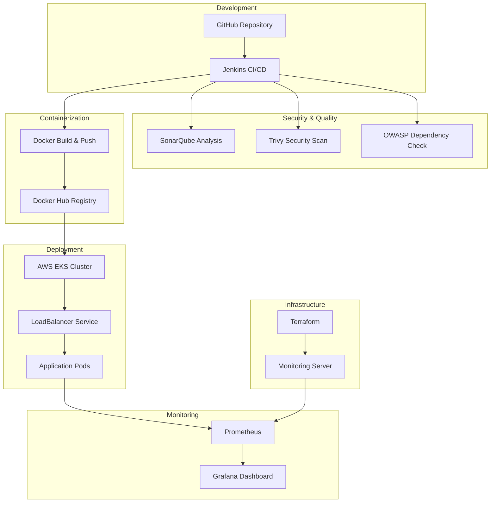

### 🎯 Project Phases

| Phase | Description | Key Components |
|-------|-------------|----------------|
| **Phase 1** | Docker Container Deployment | Docker, Container Registry |
| **Phase 2** | EKS Deployment with Monitoring | Kubernetes, Prometheus, Grafana, Security Scanning |

---

## 🛠️ Technology Stack

### Core Technologies
- **Application**: Next.js (Node.js)
- **Containerization**: Docker
- **Orchestration**: Kubernetes (AWS EKS)
- **CI/CD**: Jenkins
- **Infrastructure**: Terraform
- **Monitoring**: Prometheus + Grafana

### Security & Quality Tools
- **Code Analysis**: SonarQube
- **Vulnerability Scanning**: Trivy
- **Dependency Check**: OWASP Dependency-Check

---

## 📂 Source Code Repository

### Repository Details
- **Platform**: GitHub
- **Account**: Aseemakram19
- **Repository**: hotstar-kubernetes
- **Visibility**: Public (should be private for production)
- **Stats**: 5 stars, 97 forks
- **Languages**: 
  - JavaScript (51.3%)
  - CSS (21.8%)
  - Shell (17.6%)

### Repository Structure
```
hotstar-kubernetes/
├── Dockerfile
├── Jenkinsfile
├── K8S/
│   └── manifest.yml
├── Terraform/
│   ├── main.tf
│   └── Jenkinsfile
└── script/
    ├── jenkins.sh
    ├── docker.sh
    ├── kubetools.sh
    ├── trivy.sh
    ├── terraform.sh
    └── grafana.sh
```

---

## 🖥️ Infrastructure Setup

### AWS EC2 Virtual Machine Configuration

#### Instance Specifications
- **Name**: Hot Star Application
- **OS**: Ubuntu 20.04 LTS
- **Instance Type**: T3.xlarge
- **Storage**: 15 GB
- **Key Pair**: hotstar3.pem

#### Security Group Configuration
| Type | Protocol | Port | Source | Purpose |
|------|----------|------|--------|---------|
| SSH | TCP | 22 | 0.0.0.0/0 | Remote Access |
| HTTP | TCP | 80 | 0.0.0.0/0 | Web Traffic |
| HTTPS | TCP | 443 | 0.0.0.0/0 | Secure Web Traffic |
| Custom TCP | TCP | 8080 | 0.0.0.0/0 | Jenkins |
| Custom TCP | TCP | 9000 | 0.0.0.0/0 | SonarQube |
| Custom TCP | TCP | 587 | 0.0.0.0/0 | Gmail SMTP |
| Custom TCP | TCP | 465 | 0.0.0.0/0 | Gmail SMTP SSL |

#### Connection Setup
```bash
# Connect to EC2 instance
ssh -i hotstar3.pem ubuntu@<PUBLIC_IP>

# Switch to root user
sudo su -
```

---

## 🔧 DevOps Tools Installation

### Installation Workflow

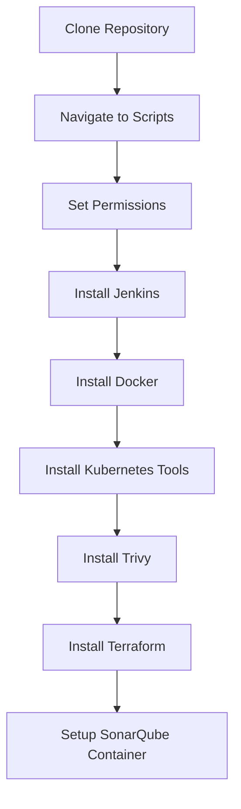

### Step-by-Step Installation

#### 1. Repository Setup
```bash
# Clone the repository
git clone https://github.com/Aseemakram19/hotstar-kubernetes.git

# Navigate to scripts directory
cd hotstar-kubernetes/script

# Make scripts executable
chmod +x *.sh
```

#### 2. Tool Installation Commands

| Tool | Command | Verification | Default Port |
|------|---------|--------------|--------------|
| **Jenkins** | `./jenkins.sh` | `systemctl status jenkins` | 8080 |
| **Docker** | `./docker.sh` | `docker version` | - |
| **Kubernetes Tools** | `./kubetools.sh` | `kubectl version` | - |
| **Trivy** | `./trivy.sh` | `trivy -v` | - |
| **Terraform** | `./terraform.sh` | `terraform version` | - |

#### 3. SonarQube Container Setup
```bash
# Run SonarQube container
docker run -d --name sonar -p 9000:9000 sonarqube:lts-community

# Verify container status
docker ps
```

---

## 🔍 SonarQube Configuration

### Initial Setup Process

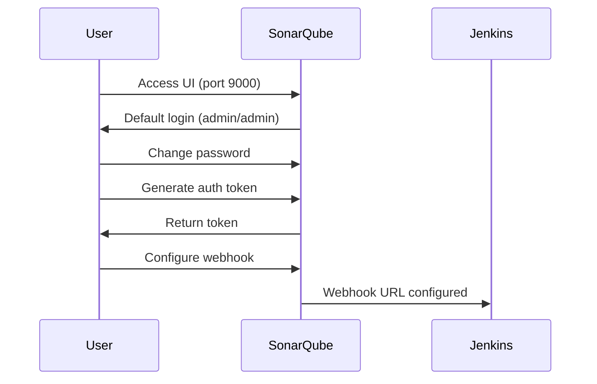

### Configuration Steps

1. **Access SonarQube**: `http://<VM_PUBLIC_IP>:9000`
2. **Login**: admin/admin (change password when prompted)
3. **Generate Token**: 
   - Administration → Security → Users
   - Click on admin user → Tokens
   - Generate new token for Jenkins integration
4. **Configure Webhook**:
   - Administration → Configuration → Webhooks
   - Name: Jenkins
   - URL: `http://<JENKINS_PUBLIC_IP>:8080/sonarqube-webhook/`

---

## 🏗️ Jenkins Setup & Configuration

### Jenkins Installation Verification
```bash
# Check Jenkins status
systemctl status jenkins

# Access Jenkins UI
# http://<VM_PUBLIC_IP>:8080
```

### Initial Setup Flow

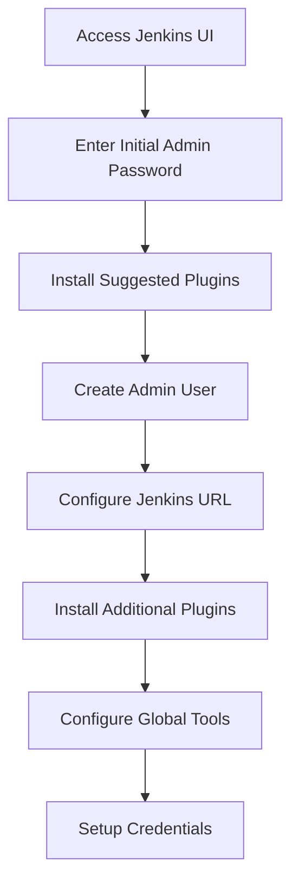

### Required Plugins Installation

| Plugin Category | Plugins |
|----------------|---------|
| **Build Tools** | Eclipse Temurin Installer, NodeJS |
| **Code Quality** | SonarQube Scanner |
| **Security** | OWASP Dependency-Check |
| **Containerization** | Docker (common, pipeline, build step) |
| **Infrastructure** | Terraform |
| **UI/UX** | Stage View, Blue Ocean |

### Global Tool Configuration

#### Tool Setup Table
| Tool | Name | Version | Installation Method |
|------|------|---------|-------------------|
| **JDK** | JDK | 17.0.9 | Install from Adoptium |
| **SonarQube Scanner** | SonarScanner | 7.0 | Install from Maven Central |
| **NodeJS** | node | 17.x | Install automatically |
| **Dependency-Check** | DC | 12.1.0 | Install from GitHub |

---

## 🔐 Jenkins Credentials Management

### Credentials Configuration Matrix

| Credential Type | ID | Usage | Details |
|----------------|----|---------| -------|
| **GitHub Token** | `github` | Repository Access | Username + Personal Access Token |
| **Docker Hub** | `docker` | Image Registry | Username + Password/Token |
| **AWS Access Key** | `aws-access-key-id` | AWS Services | Secret Text |
| **AWS Secret Key** | `aws-secret-key-id` | AWS Services | Secret Text |
| **Gmail SMTP** | `smtp-gmail-credentials` | Email Notifications | Username + App Password |

### Credential Setup Process
1. **Manage Jenkins** → **Manage Credentials**
2. **System** → **Global credentials**
3. **Add Credentials** for each type above

---

## 📧 Email Notification Setup

### SMTP Configuration

#### Email Notification Settings
```yaml
SMTP Server: smtp.gmail.com
Use SMTP Authentication: ✓
Username: <your-gmail-address>
Password: <gmail-app-password>
Use SSL: ✓
SMTP Port: 465
```

#### Extended Email Notification Settings
```yaml
SMTP Server: smtp.gmail.com
SMTP Port: 587
Use SMTP Authentication: ✓
Credentials: smtp-gmail-credentials
Use TLS: ✓
Default Suffix: @gmail.com
```

---

## 🚀 CI/CD Pipeline Configuration

### Pipeline Creation Workflow

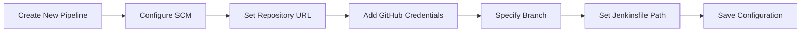

### Pipeline Stages Overview

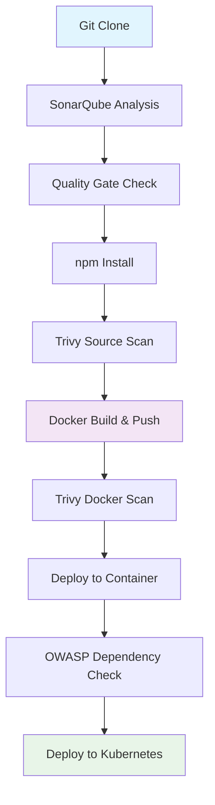

### Key Pipeline Stages Details

| Stage | Purpose | Tools Used | Output |
|-------|---------|------------|--------|
| **Git Clone** | Source code checkout | Git | Code repository |
| **SonarQube Analysis** | Static code analysis | SonarQube Scanner | Code quality metrics |
| **npm Install** | Dependency installation | NodeJS/npm | node_modules |
| **Trivy Source Scan** | Source vulnerability scan | Trivy | trivy.txt report |
| **Docker Build & Push** | Container creation | Docker | Image in Docker Hub |
| **Trivy Docker Scan** | Container vulnerability scan | Trivy | trivy-docker.txt report |
| **Deploy to Container** | Local container deployment | Docker | Running container |
| **Dependency Check** | Security dependency scan | OWASP DC | Dependency report |

---

## ☸️ AWS EKS Cluster Setup

### Prerequisites Setup

#### IAM User Creation
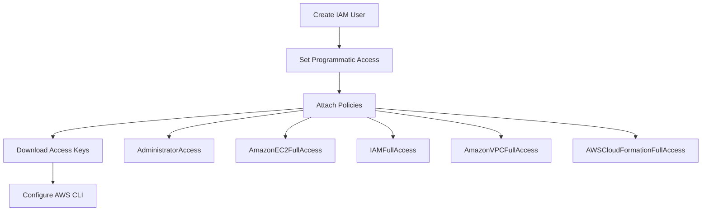

#### AWS CLI Configuration
```bash
# Configure AWS CLI
aws configure

# Enter when prompted:
# AWS Access Key ID: <your-access-key>
# AWS Secret Access Key: <your-secret-key>
# Default region: ap-south-1
# Default output format: [Enter for default]
```

### EKS Cluster Creation
```bash
# Create EKS cluster
eksctl create cluster --name hotstar-cluster --region <your-region>

# This creates:
# - EKS cluster
# - Worker nodes (EC2 instances)
# - Associated networking components
# - Takes 5-10 minutes to complete
```

---

## 🔧 Kubernetes Deployment

### Deployment Architecture

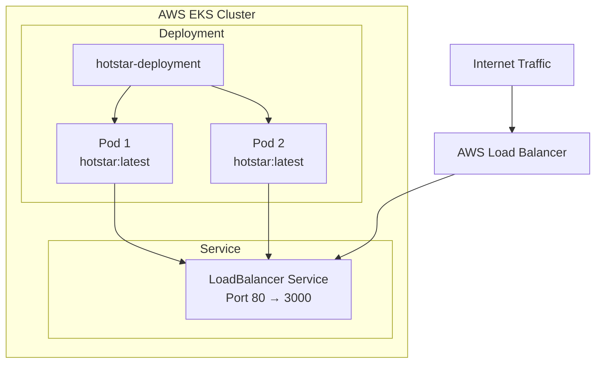

### Manifest File Configuration

```yaml
# K8S/manifest.yml structure:
apiVersion: apps/v1
kind: Deployment
metadata:
  name: hotstar-deployment
spec:
  replicas: 2
  selector:
    matchLabels:
      app: hotstar
  template:
    metadata:
      labels:
        app: hotstar
    spec:
      containers:
      - name: hotstar
        image: asimyakram19/hotstar
        ports:
        - containerPort: 3000
---
apiVersion: v1
kind: Service
metadata:
  name: hotstar-service
spec:
  selector:
    app: hotstar
  ports:
    - protocol: TCP
      port: 80
      targetPort: 3000
  type: LoadBalancer
```

### Deployment Commands
```bash
# Navigate to Kubernetes manifests
cd ~/hotstar-kubernetes/K8S

# Apply the manifest
kubectl apply -f manifest.yml

# Verify deployment
kubectl get all

# Check service external IP
kubectl get svc hotstar-service
```

---

## 🔄 Auto-Healing Verification

### Testing Process

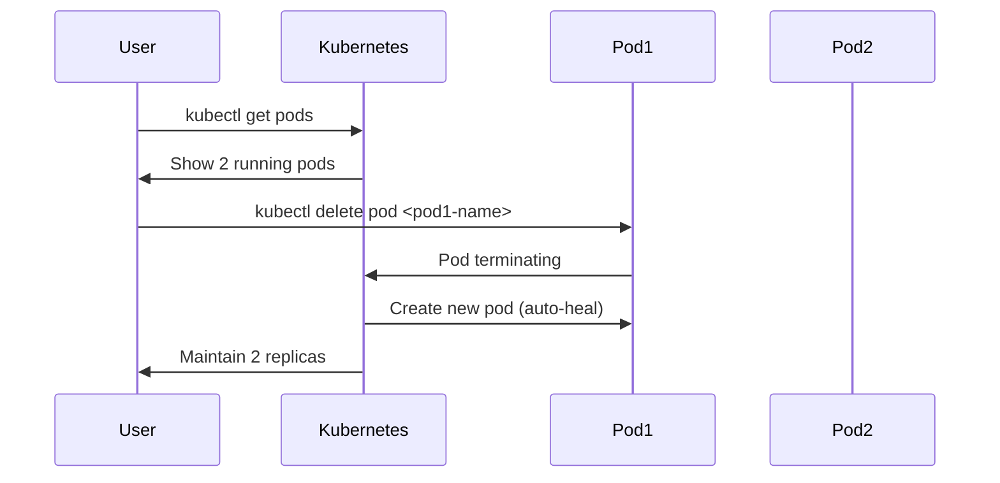

### Commands for Testing
```bash
# List current pods
kubectl get pods

# Delete one pod (replace <pod-name> with actual name)
kubectl delete pod <pod-name>

# Immediately check pods again
kubectl get pods

# Observe: New pod created automatically
# One pod will show recent age, demonstrating auto-healing
```

---

## 🌐 Domain & SSL Configuration

### DNS Setup Process

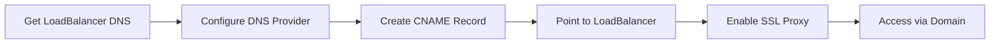

### Configuration Steps

1. **Get LoadBalancer DNS**: From `kubectl get all` output
2. **DNS Provider Setup** (e.g., Cloudflare):
   - Create CNAME record: `hotstar`
   - Point to: `<AWS-LoadBalancer-DNS>`
   - Proxy Status: Proxied (for SSL)
3. **Access**: `https://hotstar.cloudaim.com`

---

## 📊 Monitoring Setup

### Monitoring Architecture

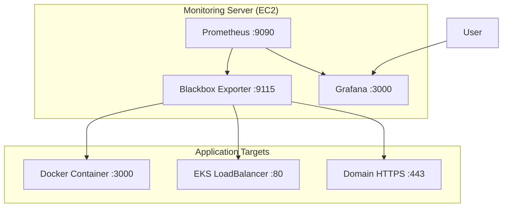

### Terraform Infrastructure

#### Monitoring Server Jenkins Pipeline

**Pipeline Configuration:**
- **Type**: Parameterized Build
- **Parameter**: Choice Parameter `action` (apply/destroy)
- **SCM**: Git repository
- **Script Path**: `Terraform/Jenkinsfile`

#### Terraform Resources (`Terraform/main.tf`)

| Resource | Type | Configuration |
|----------|------|---------------|
| **Security Group** | `monitoring-security-group` | SSH(22), Grafana(3000), Prometheus(9090), Blackbox(9115) |
| **EC2 Instance** | `monitoring-server` | t2.medium, Ubuntu, specified key pair |
| **Output** | Public IP | For accessing monitoring services |

### Tool Installation on Monitoring Server

#### Grafana Installation
```bash
# Copy and run grafana script
chmod +x grafana.sh
./grafana.sh

# Access: http://<Monitoring_Server_IP>:3000
# Default login: admin/admin
```

#### Prometheus Installation
```bash
# Download Prometheus
wget <prometheus-download-url>

# Extract and run
tar xvf prometheus-*.tar.gz
cd prometheus-*
./prometheus &

# Access: http://<Monitoring_Server_IP>:9090
```

#### Blackbox Exporter Installation
```bash
# Download Blackbox Exporter
wget <blackbox-exporter-download-url>

# Extract and run
tar xvf blackbox_exporter-*.tar.gz
cd blackbox_exporter-*
./blackbox_exporter &

# Access: http://<Monitoring_Server_IP>:9115
```

---

## 📈 Monitoring Configuration

### Prometheus Configuration

#### Target Configuration (`prometheus.yml`)
```yaml
scrape_configs:
  - job_name: 'hotstar-probes'
    metrics_path: /probe
    params:
      module: [http_2xx]
    static_configs:
      - targets:
          - http://<Docker_Container_IP>:3000
          - https://hotstar.cloudaim.com
    relabel_configs:
      - source_labels: [__address__]
        target_label: __param_target
      - source_labels: [__param_target]
        target_label: instance
      - target_label: __address__
        replacement: <Monitoring_Server_IP>:9115
```

### Grafana Dashboard Setup

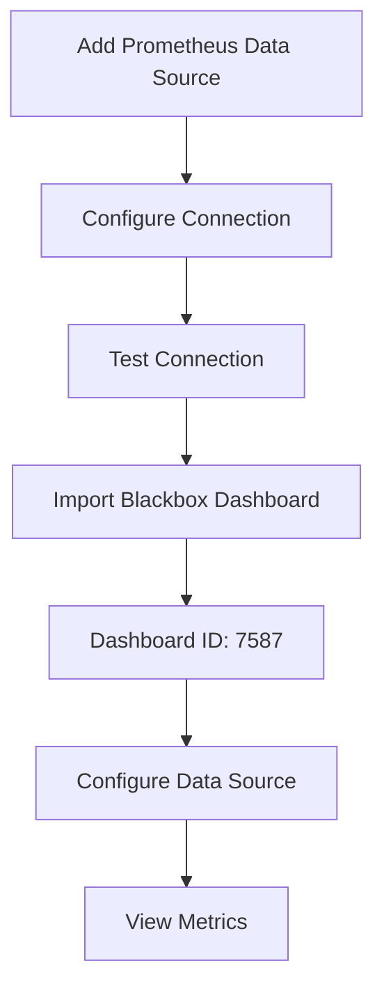

#### Data Source Configuration
- **Type**: Prometheus
- **URL**: `http://localhost:9090`
- **Access**: Server (default)

#### Dashboard Import
- **Dashboard ID**: 7587 (Blackbox Exporter)
- **Data Source**: Select configured Prometheus
- **Metrics Available**: Probe success, Latency, SSL certificate details

---

## 🧹 Cleanup Process

### Resource Cleanup Workflow

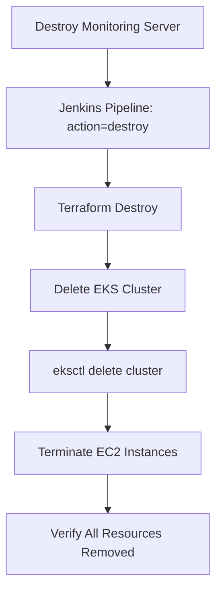

### Cleanup Commands

#### 1. Monitoring Server Cleanup
```bash
# Via Jenkins Pipeline
# Build with Parameters → action: destroy
```

#### 2. EKS Cluster Cleanup
```bash
# Delete EKS cluster
eksctl delete cluster --name hotstar-cluster --region <your-region>

# This removes:
# - EKS cluster
# - Worker nodes
# - LoadBalancers
# - Associated networking
```

#### 3. EC2 Instance Cleanup
- AWS Console → EC2 → Select instance → Terminate

---

## 🔍 Troubleshooting Guide

### Common Issues & Solutions

| Issue | Cause | Solution |
|-------|-------|----------|
| **npm Install Fails** | NodeJS tool misconfigured | Rename tool from 'nodejs' to 'node' |
| **SonarQube Connection Failed** | Wrong webhook URL | Verify webhook URL format |
| **Docker Push Failed** | Missing credentials | Check Docker Hub credentials in Jenkins |
| **EKS Access Denied** | AWS credentials issue | Verify AWS CLI configuration |
| **Monitoring Targets Down** | Wrong IP/port configuration | Update prometheus.yml with correct targets |

### Verification Commands

```bash
# Jenkins service
systemctl status jenkins

# Docker service
docker ps

# Kubernetes cluster
kubectl get nodes

# Application pods
kubectl get pods

# Services and external IPs
kubectl get svc

# AWS CLI configuration
aws sts get-caller-identity
```

---

## 📋 Best Practices & Security

### Security Considerations

#### Repository Security
- ✅ Use private repositories for production
- ✅ Implement branch protection rules
- ✅ Enable 2FA on GitHub account

#### Credential Management
- ✅ Use Jenkins credential store
- ✅ Never hardcode secrets in code
- ✅ Rotate access keys regularly
- ✅ Use least privilege principle for IAM

#### Container Security
- ✅ Scan images with Trivy
- ✅ Use official base images
- ✅ Keep dependencies updated
- ✅ Implement OWASP checks

#### Kubernetes Security
- ✅ Use network policies
- ✅ Implement RBAC
- ✅ Scan cluster configurations
- ✅ Monitor resource usage

### Performance Optimization

#### Resource Allocation
- **EC2 Instance**: T3.xlarge for Jenkins server
- **EKS Nodes**: Auto-scaling based on demand
- **Monitoring**: T2.medium sufficient for monitoring stack

#### Scaling Configuration
- **Horizontal Pod Autoscaler**: Scale based on CPU/memory
- **Cluster Autoscaler**: Scale nodes based on pod demand
- **Load Balancer**: Distribute traffic across pods

---

## 📚 Additional Resources

### Documentation Links
- [Jenkins Documentation](https://www.jenkins.io/doc/)
- [Kubernetes Documentation](https://kubernetes.io/docs/)
- [AWS EKS Documentation](https://docs.aws.amazon.com/eks/)
- [Terraform Documentation](https://www.terraform.io/docs/)
- [Prometheus Documentation](https://prometheus.io/docs/)
- [Grafana Documentation](https://grafana.com/docs/)

### Monitoring Dashboards
- **Blackbox Exporter**: Grafana Dashboard ID 7587
- **Kubernetes Cluster**: Grafana Dashboard ID 315
- **Node Exporter**: Grafana Dashboard ID 1860

### Useful Commands Reference
```bash
# Jenkins
systemctl restart jenkins
systemctl status jenkins

# Docker
docker ps
docker logs <container-name>
docker exec -it <container-name> /bin/bash

# Kubernetes
kubectl get all
kubectl describe pod <pod-name>
kubectl logs <pod-name>
kubectl exec -it <pod-name> -- /bin/bash

# AWS
aws eks describe-cluster --name <cluster-name>
aws ec2 describe-instances
```

---

*This guide provides a comprehensive overview of deploying a production-ready application using modern DevOps practices. Remember to follow security best practices and regularly update tools and dependencies.*
